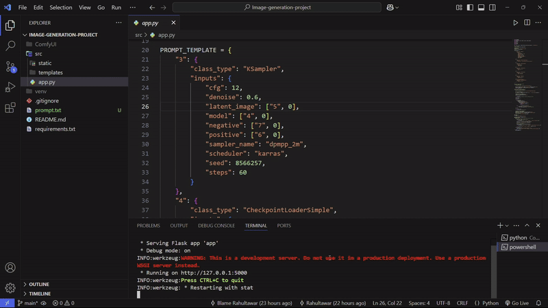

# AI Image Generator



This project is an AI-based image generator utilizing Flask for the web server, WebSockets for real-time communication, and ComfyUI integrated with Stable Diffusion for high-quality image generation based on user prompts.

## Table of Contents

- [Requirements](#requirements)
  - [Hardware Requirements](#hardware-requirements)
  - [Software Requirements](#software-requirements)
- [Installation](#installation)
- [Usage](#usage)
- [Project Files](#project-files)
- [License](#license)
- [Acknowledgements](#acknowledgements)

## Requirements

### Hardware Requirements

- CPU: Modern multi-core processor
- RAM: 16GB or more
- GPU: NVIDIA GPU with at least 4GB VRAM (for GPU acceleration)

### Software Requirements

- Python 3.7+
- Flask
- Requests
- WebSocket-client
- UUID
- Pillow

## Installation

1. Clone the repository:
    ```sh
    git clone <repository-url>
    cd <repository-directory>
    ```

2. Install the required dependencies:
    ```sh
    pip install -r requirements.txt
    ```

3. Run the ComfyUI server:
    ```sh
    # For CPU
    ./run_cpu.bat

    # For NVIDIA GPU
    ./run_nvidia_gpu.bat
    ```

4. Start the Flask application:
    ```sh
    python src/app.py
    ```

## Usage

1. Open your web browser and navigate to `http://127.0.0.1:5000`.
2. Enter a prompt in the text area and click the generate button.
3. The generated image will be displayed on the page, and you can download it using the provided download link.

## Project Files

- [`src/app.py`](src/app.py ): Main Flask application file handling routes and image generation logic.
- [`src/static/script.js`](src/static/script.js ): JavaScript file for handling user interactions and making requests to the backend.
- [`src/static/styles.css`](src/static/styles.css ): CSS file for styling the web interface.
- [`src/templates/index.html`](src/templates/index.html ): HTML template for the web interface.

## Acknowledgements

- Developed & Managed by Rahul Tawar
- Uses [ComfyUI](https://github.com/comfyanonymous/ComfyUI) for image generation.
- Utilizes Stable Diffusion for generating high-quality images.
